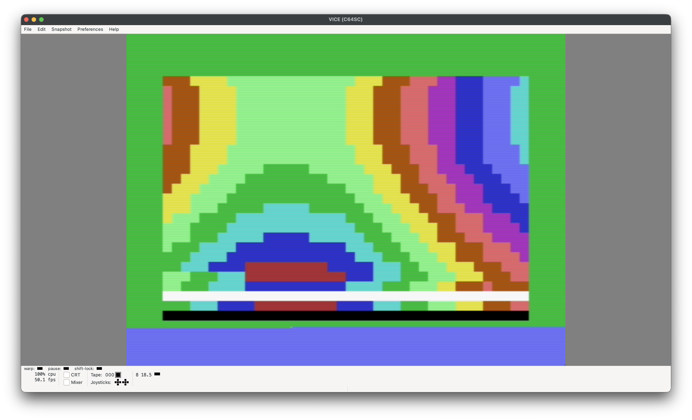
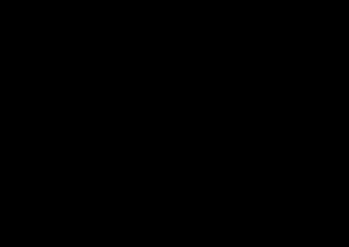
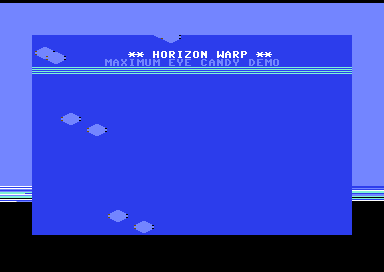
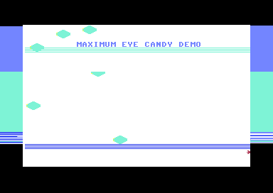
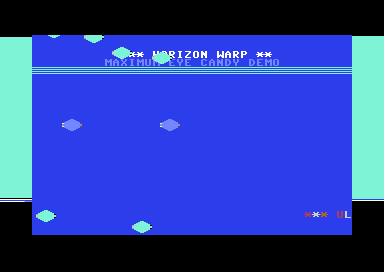
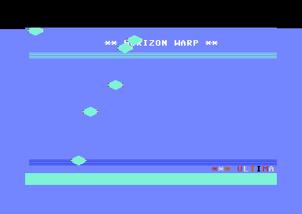
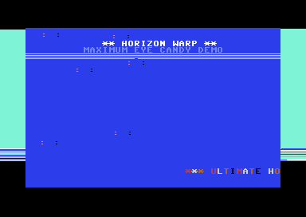
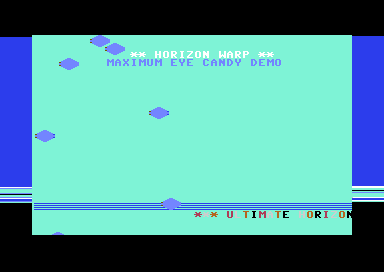

# C64 Raster Plasma Scroller



PAL Commodore 64 visual demo written in 6502 assembly for ACME. The program
chains four raster interrupts to combine a rainbow border, animated sprites, a
smooth text scroller, a plasma field, raster bars, and a static logo frame.
The preview and gallery images are live VICE captures of the checked-in PRG.

## Features

- Four PAL raster IRQ stages at approximately lines 50, 100, 150, and 200.
- Eight multicolor sprites with phase-shifted sine motion and colour cycling.
- Smooth character scroller with per-frame fine scrolling.
- Table-driven plasma background and row-based colour wave.
- Top rainbow raster, bottom raster bars, logo, and decorative borders.
- ROM charset copied to RAM and modified for the demo palette.
- Deterministic ACME build, PRG-header checks, and GitHub Actions CI.

## Build and run

Install ACME 0.97 or newer and VICE, then run:

```sh
make
x64sc -autostart build/c64_raster_plasma_scroller.prg
```

The PRG is a C64 BASIC-loadable file. Its `$0801` stub executes `SYS 4608`
(`$1200`), the `Start` routine in the assembled image. `make clean` removes
generated output; `make check` rebuilds and validates the PRG header, size, and
tracked checksums.

## Effect gallery

These representative frames were captured from VICE after booting the same
build. The effects are continuous and overlap in time; labels identify the
primary stage/component visible in each frame.

| Stage | Capture |
| --- | --- |
| IRQ1 rainbow raster |  |
| IRQ2 sprites and colour wave |  |
| IRQ3 plasma field |  |
| IRQ3 smooth scroller |  |
| IRQ4 raster bars |  |
| Logo and borders |  |
| RAM charset |  |

See [the effect notes](docs/EFFECTS.md) for update order and data flow.

## Memory and timing

| Region | Purpose |
| --- | --- |
| `$0801` | BASIC loader (`SYS 4608`) |
| `$1200` | Program entry and IRQ code |
| `$0400-$07E7` | Screen RAM |
| `$D800-$DBE7` | Colour RAM |
| `$2000-$27FF` | RAM charset |
| `$2800-$29FF` | Sprite data |
| `$FB-$FF` | Zero-page scratch/state |

`SyncFrame` waits for the frame boundary, then the IRQ chain acknowledges the
VIC raster interrupt, performs one bounded stage, and arms the next raster line.
The chain returns to IRQ1 after IRQ4, so no main-loop timing assumption is
needed for the visual effects.

## Repository layout

- `c64_raster_plasma_scroller.s` — annotated 6502 source.
- `Makefile` — strict ACME build, checksum generation, and validation targets.
- `docs/FUNCTIONS.md` — routine-by-routine reference.
- `docs/EFFECTS.md` — effect logic and screenshot gallery.
- `AUDIT.md` — audit findings and repair record.
- `assets/effects/` — live VICE captures used in documentation.
- `.github/workflows/ci.yml` — reproducible build/check workflow.
- `SHA256SUMS.txt` — checksums for release inputs and captures.

## License

Copyright (C) 2026 Ulf Bertilsson. Released under the GNU General Public
License, version 3 or later. See [LICENSE](LICENSE) and [NOTICE](NOTICE).
